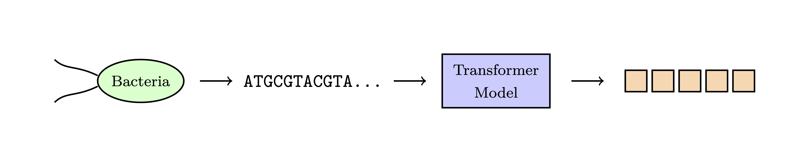
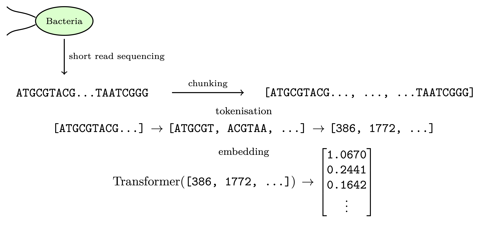

# genome2vec

This repository provides a framework for generating (fixed-dimensional) genome embeddings using transformer-based foundation models. 



## Installation

# Prerequisites
- python 3.11


# Setup
1. Clone the repository
```
git clone <repository-url>
cd genome2vec
```

2. Setup conda environment
```
conda create --name genome2vec python=3.11
conda activate genome2vec
```

3. Install requirements
```
pip install -r requirements.txt
```

## Usage

## Method

Sequences are parsed from FASTA files, chunked, tokenized then embedded.



### Chunking

Sequences are chunked according to model context limits

### Tokenisation

Each chunked sequence is tokenized either into non-overlapping k-mers (e.g. 6-mers) or using Byte Pair Encoding (BPE), depending on the chosen model.
The tokenizer converts these tokens into numerical IDs within the Transformer model's vocabulary.

Example: [2, 312, ..., 3671] — each integer corresponds to a token (e.g. a specific k-mer or BPE token) in the tokenizer’s vocabulary.

### Embedding Generation

Each foundation model produces **token-level hidden states for each layer**. By default, the pipeline uses the **last hidden layer** as the representation of a chunk.

Chunk embeddings are stacked across all chunks to produce one **genome-level embedding vector**.

Example:
Consider a model with a maximum input length of 1,000 6-mer tokens (corresponding to 6,000 nucleotides). For a genome sequence of length 12,000 nucleotides, the sequence is first split into two non-overlapping chunks of 6,000 nucleotides each.

Each chunk is tokenized independently into 6-mers, and each token is mapped by the Transformer to a vector of size `embedding_dimension`. The resulting token embeddings for each chunk are stacked to form a tensor of shape (1000, `embedding_dimension`).

Token embeddings from different chunks are never jointly processed by the model: tokens within a chunk can attend only to other tokens in the same chunk. After embeddings have been generated for all chunks, the stacked token embeddings across chunks are concatenated and averaged along the token dimension to produce a single fixed-length embedding for the full genome of shape (1, `embedding_dimension`).

As a result, information from different chunks is integrated only at the final averaging step; there is no cross-chunk contextualization during model inference.

This final embedding is written as a PyTorch `.pt` tensor to the output directory.

## How It Works (Pipeline Summary)

1. **Load FASTA**  
   `parse_fasta()` reads sequences and concatenates them into one string.

2. **Split Sequence**  
   `split_sequence_for_tokenizer()` creates chunks compatible with model limits.

3. **Tokenise & Encode**  
   Each chunk is converted to k-mer or BPE tokens and passed through the transformer.

4. **Extract Hidden States**  
   The model returns hidden layers of token embeddings.

5. **Select Layer**  
   The pipeline selects the *last hidden layer*.

6. **Aggregate Across Chunks**  
   All chunk embeddings are stacked and averaged to yield a single genome embedding.

7. **Save Output**  
   A `.pt` tensor is written to the output directory.

## Environment Setup

_For running on an external GPU server with CUDA version 12.1+_

First, install [Conda](https://conda.io/projects/conda/en/latest/user-guide/install/index.html). Then, run

```
conda create --name genome2vec python=3.11
```
this creates an environment called `genome2vec` in which we will install our packages. Now run
```
conda activate genome2vec
```
to activate the environment, then, install gpu specific packages with
```
pip install -r requirements-gpu.txt
```
which installs torch related dependencies for the correct CUDA version. Next, install
all other dependencies with 
```
pip install -r requirements.txt
```
The first 
finally, run
```
pip install -e .
```
to setup the repository for development.

n.b.: Conda is just a way of managing your working environment, running the above command with a
[Python Virtual Environment (venv)](https://docs.python.org/3/library/venv.html) will also work.

## How to Use

Run
```
python generate_embeddings.py path/to/assembly/files
```

## Acknowledgements

The general framework of this repository was inspired by the teachings of [Tristan Goss](https://uk.linkedin.com/in/tristan-goss) while at [Earthwave](https://earthwave.co.uk)